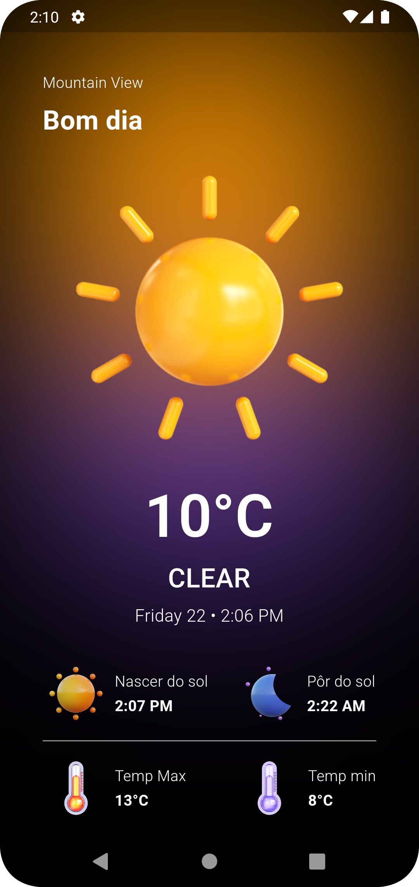

## Sobre o projeto

O aplicativo é desenvolvido em Flutter e tem como objetivo fornecer aos usuários informações precisas sobre o clima em sua região e em outras localidades. Ele realiza requisições à API de previsão do tempo e exibe os dados de forma amigável e intuitiva na interface do usuário.

### Funcionalidades Principais
- Requisição de Previsão do Tempo: O aplicativo realiza requisições à API de previsão do tempo para obter informações atualizadas sobre as condições climáticas.
- Localização Atual: Utilizando a biblioteca Geolocator, o aplicativo detecta a localização atual do usuário para fornecer previsões do tempo específicas para sua região.
- Suporte Internacional: A integração com a biblioteca intl permite a exibição de datas e horários no formato local do usuário, tornando o aplicativo acessível globalmente.
- Gerenciamento de Estado: O aplicativo utiliza o flutter_bloc e equatable para gerenciar o estado da aplicação de forma eficiente e escalável.

### Bibliotecas Utilizadas

- intl: ^0.19.0
- geolocator: ^10.1.0
- weather: ^3.1.1
- flutter_bloc: ^8.1.3
- equatable: ^2.0.5

## Demonstração

## Contribuindo

Contribuições são bem-vindas! Sinta-se à vontade para abrir uma issue para relatar bugs, solicitar novas funcionalidades ou enviar pull requests com melhorias para o projeto.